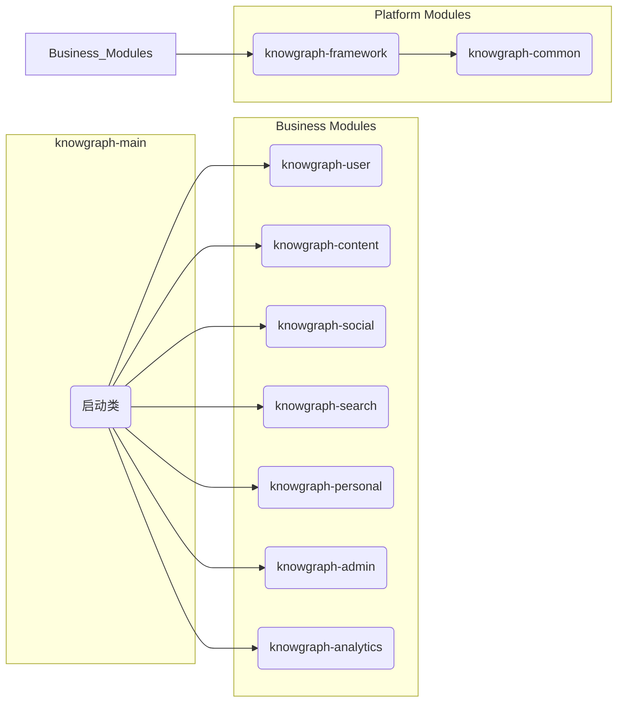

f# KnowGraph-backend

## 1. 项目简介

**KnowGraph** 是一个面向大学生的知识分享和学习交流数字化平台，旨在促进学习资源的高效共享和学术交流的深度互动。

**核心价值:**

- **知识内容发布:** 用户可发布学习笔记、技术文章、经验分享等内容。
- **互动交流机制:** 支持点赞、评论、收藏等社交互动功能。
- **分类标签系统:** 通过标签和分类快速定位相关知识内容。
- **搜索推荐服务:** 智能搜索和个性化内容推荐。
- **用户成长体系:** 积分等级、勋章奖励等激励机制。

本项目为 KnowGraph 平台的后端服务。

## 2. 技术栈

- **核心框架:** Spring Boot 3.2.x
- **持久层框架:** MyBatis
- **数据库:** MySQL 8.0
- **缓存:** Redis
- **认证授权:** Spring Security + JWT
- **构建工具:** Maven

## 3. 架构设计

项目采用**多模块（Multi-module）**架构，遵循**高内聚、低耦合**的设计原则，将不同的业务领域划分到独立的模块中，便于团队协作、功能扩展和长期维护。

### 模块划分

| 模块名称              | 核心职责                                               |
| --------------------- | ------------------------------------------------------ |
| `knowgraph-main`      | **主启动模块**，负责整合所有模块并启动应用。           |
| `knowgraph-framework` | **框架模块**，提供通用框架配置（如 Web、安全、缓存）。 |
| `knowgraph-common`    | **公共模块**，存放通用工具类、DTO、常量等。            |
| `knowgraph-user`      | **用户中心模块**，负责用户注册、登录、个人信息等。     |
| `knowgraph-content`   | **内容管理模块**，负责文章、笔记的发布与管理。         |
| `knowgraph-social`    | **互动社交模块**，负责点赞、评论、收藏、关注等。       |
| `knowgraph-search`    | **搜索发现模块**，负责内容搜索与推荐。                 |
| `knowgraph-personal`  | **个人空间模块**，负责个人主页、发布历史、收藏夹等。   |
| `knowgraph-admin`     | **系统管理模块**，负责后台管理功能，如审核、用户管理。 |
| `knowgraph-analytics` | **统计分析模块**，负责数据统计与分析。                 |

### 项目结构图



## 4. 快速开始

### 环境准备

- JDK 17
- Maven 3.6+
- MySQL 8.0+
- Redis

### 启动步骤

1.  **克隆项目**

    ```bash
    git clone <your-repository-url>
    cd KnowGraph-backend
    ```

2.  **数据库初始化**

    - 在您的 MySQL 中创建一个名为 `knowgraph_db` 的数据库。
    - `CREATE DATABASE knowgraph_db;`

3.  **修改配置文件**

    - 打开 `knowgraph-main/src/main/resources/application.yml`。
    - 修改 `spring.datasource` 下的 `username` 和 `password` 为您自己的数据库用户名和密码。
    - 如果您的 Redis 需要密码，请在 `spring.data.redis` 下配置。

4.  **编译并运行**

    - 使用您的 IDE（如 IntelliJ IDEA）打开项目，等待 Maven 加载完依赖。
    - 找到 `knowgraph-main` 模块下的 `KnowGraphBackendApplication.java` 文件，直接运行 `main` 方法。
    - 当控制台输出 `Started KnowGraphBackendApplication in ... seconds` 时，表示后端服务启动成功。

5.  **访问服务**
    服务默认启动在 `http://localhost:8080`。

## 5. API 文档

(后续将集成 Swagger / OpenAPI，提供在线 API 文档)
